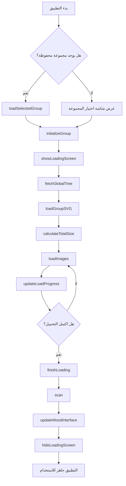

# 📚 خريطة المنهج الطبي التفاعلية (Interactive Medical Curriculum Map)

هذا المشروع يوفر عرضًا تفاعليًا ومبسطًا للمسار التعليمي والملفات الدراسية لمجموعة من الوحدات الطبية (مثل CVS و RRS). يهدف هذا العرض إلى مساعدة الطلاب في تنظيم موادهم والوصول السريع إلى الملفات والمحاضرات الرئيسية.

## ✨ المميزات الرئيسية

* **تأثير التكبير/التوهج:** عند وضع مؤشر الماوس على أي مستطيل، يتم تكبير الجزء المعني من الخريطة مع إضاءة ديناميكية لتمييز المنطقة.
* **وصول مباشر للمحتوى:** النقر على أي منطقة تفاعلية يفتح ملف PDF أو رابط الفيديو المرتبط بها مباشرة.
* **ترخيص MIT:** الكود مفتوح المصدر بالكامل، ومتاح للنسخ والاستخدام والتعديل.

---

## 🚀 كيفية تشغيل المشروع

لتشغيل هذا المشروع، لا تحتاج إلى أي أدوات برمجية معقدة. يكفي متصفح ويب حديث.

### 1. 📥 تحميل المشروع

**الطريقة الأولى: تحميل مباشر (مُوصى بها)**

[](https://github.com/MUE24Med/semester-3/archive/refs/heads/main.zip)

**الطريقة الثانية: باستخدام Git**

```bash
git clone https://github.com/MUE24Med/semester-3.git
cd semester-3
```

### 2. 📂 هيكل المجلدات

```
semester-3/
│
├── index.html          # الصفحة الرئيسية
├── script.js           # جافاسكريبت الرئيسي
├── style.css           # ملف التنسيق
├── sw.js              # Service Worker للعمل بدون إنترنت
│
├── Groups/            # ملفات SVG للمجموعات
│   ├── group-A.svg
│   ├── group-B.svg
│   └── ...
│
└── image/             # الصور والشعارات
    ├── wood.webp
    ├── logo-A.webp
    └── ...
```

### 3. 🎨 دليل الألوان

* 🔴 `.q { stroke: red; }`         → أسئلة
* 🔵 `.v { stroke: blue; }`        → فيديو شرح
* ⚪️ `.i { stroke: white; }`      → مواد أخرى
* 🟣 `.a { stroke: purple; }`      → إجابات
* 🟢 `.s { stroke: green; }`       → سكشن العملي
* 🟡 `.l { stroke: yellow; }`      → محاضرات

### 4. ▶️ التشغيل

1. فك ضغط الملف المُحمّل
2. افتح ملف **`index.html`** باستخدام أي متصفح ويب حديث (Chrome, Firefox, Edge)
3. اختر مجموعتك وابدأ التصفح!

**⚠️ ملاحظة هامة:** 
إذا واجهت مشكلة في فتح أي ملف، تأكد من أن صاحب الملف قد قام بتفعيل خاصية **"المشاركة العامة (Anyone with the link)"** على Google Drive.

---

## 📖 فهرس دوال جافاسكربت (JavaScript Functions Index)

### 🔧 دوال التهيئة والإعداد (Initialization)

| الرقم | اسم الدالة | الوصف |
|------|------------|-------|
| **[01]** | `fetchGlobalTree()` | جلب شجرة الملفات الكاملة من GitHub API |
| **[02]** | `saveSelectedGroup(group)` | حفظ المجموعة المختارة في LocalStorage |
| **[03]** | `loadSelectedGroup()` | استعادة المجموعة المحفوظة عند الدخول |
| **[06]** | `initializeGroup(groupLetter)` | **الدالة الأم** - تهيئة المجموعة بالكامل |

### 📊 دوال شاشة التحميل (Loading Screen)

| الرقم | اسم الدالة | الوصف |
|------|------------|-------|
| **[04]** | `showLoadingScreen(groupLetter)` | تفعيل شاشة التحميل والمصابيح |
| **[05]** | `hideLoadingScreen()` | إخفاء شاشة التحميل |
| **[07]** | `updateLoadProgress()` | تحديث نسبة التحميل وإضاءة اللمبات |
| **[08]** | `getActualFileSize(url)` | الحصول على الحجم الحقيقي للملف |
| **[09]** | `estimateFileSize(url)` | تقدير حجم الملفات بناءً على النوع |
| **[10]** | `calculateTotalSize()` | حساب الحجم الإجمالي المتوقع للتحميل |

### 🖼️ دوال SVG والصور (SVG & Images)

| الرقم | اسم الدالة | الوصف |
|------|------------|-------|
| **[11]** | `loadGroupSVG(groupLetter)` | تحميل وحقن ملف الـ SVG الخاص بالمجموعة |
| **[12]** | `updateWoodLogo(groupLetter)` | تحديث شعار المجموعة في واجهة الخشب |
| **[14]** | `updateDynamicSizes()` | ضبط أبعاد الـ ViewBox للـ SVG |
| **[18]** | `loadImages()` | تحميل الصور الفعلية وتحديث الـ Progress |
| **[19]** | `finishLoading()` | إنهاء عملية التحميل وعرض الواجهة النهائية |

### 📋 دوال الواجهة الرئيسية (Main Interface)

| الرقم | اسم الدالة | الوصف |
|------|------------|-------|
| **[13]** | `updateWoodInterface()` | **الأهم** - بناء القوائم، البحث، والأرقام الذكية |
| **[20]** | `renderNameInput()` | عرض حقل إدخال اسم المستخدم |
| **[21]** | `getDisplayName()` | الحصول على اسم المستخدم المحفوظ |
| **[22]** | `updateWelcomeMessages()` | تحديث رسائل الترحيب بالاسم |

### 🔍 دوال البحث والتصفية (Search & Filter)

| الرقم | اسم الدالة | الوصف |
|------|------------|-------|
| **[23]** | `normalizeArabic(text)` | تطبيع النص العربي (إزالة التشكيل والهمزات) |
| **[24]** | `autoTranslate(filename)` | ترجمة تلقائية من إنجليزي لعربي |
| **[25]** | `isSubjectFolder(folderName)` | التحقق إذا كان المجلد مادة دراسية |

### 📄 دوال فتح الملفات (File Operations)

| الرقم | اسم الدالة | الوصف |
|------|------------|-------|
| **[26]** | `smartOpen(item)` | فتح الملفات (PDF أو روابط خارجية) بذكاء |

### 🎨 دوال التأثيرات البصرية (Visual Effects)

| الرقم | اسم الدالة | الوصف |
|------|------------|-------|
| **[15]** | `startHover()` | إدارة تأثيرات التكبير والإضاءة عند الهوفر |
| **[27]** | `cleanupHover()` | إزالة تأثيرات الهوفر |
| **[28]** | `getCumulativeTranslate(element)` | حساب الإزاحة التراكمية للعنصر |
| **[29]** | `getGroupImage(element)` | الحصول على صورة المجموعة الأصلية |

### 📝 دوال معالجة النصوص (Text Processing)

| الرقم | اسم الدالة | الوصف |
|------|------------|-------|
| **[16]** | `wrapText(el, maxW)` | معالجة النصوص الطويلة داخل المستطيلات |
| **[17]** | `processRect(r)` | معالجة مستطيل واحد (إضافة تسميات وأحداث) |
| **[30]** | `scan()` | فحص ومعالجة جميع مستطيلات الخريطة |

### 🧭 دوال التنقل (Navigation)

| الرقم | اسم الدالة | الوصف |
|------|------------|-------|
| **[31]** | `goToWood()` | الانتقال إلى بداية الخريطة (الخشب) |
| **[32]** | `goToMapEnd()` | الانتقال إلى نهاية الخريطة |

### 🛠️ دوال مساعدة (Utility Functions)

| الرقم | اسم الدالة | الوصف |
|------|------------|-------|
| **[33]** | `debounce(func, delay)` | تأخير تنفيذ دالة لتحسين الأداء |
| **[34]** | `addFixedScrollStyles()` | إضافة أنماط CSS للتمرير المحسن |

---

## 🔄 سير عمل التطبيق (Application Flow)



---

## 📜 الترخيص

هذا المشروع مرخص بموجب ترخيص **MIT License**.

```
MIT License

Copyright (c) 2025 MUE24Med

Permission is hereby granted, free of charge, to any person obtaining a copy
of this software and associated documentation files (the "Software"), to deal
in the Software without restriction, including without limitation the rights
to use, copy, modify, merge, publish, distribute, sublicense, and/or sell
copies of the Software, and to permit persons to whom the Software is
furnished to do so, subject to the following conditions:

The above copyright notice and this permission notice shall be included in all
copies or substantial portions of the Software.

THE SOFTWARE IS PROVIDED "AS IS", WITHOUT WARRANTY OF ANY KIND, EXPRESS OR
IMPLIED, INCLUDING BUT NOT LIMITED TO THE WARRANTIES OF MERCHANTABILITY,
FITNESS FOR A PARTICULAR PURPOSE AND NONINFRINGEMENT. IN NO EVENT SHALL THE
AUTHORS OR COPYRIGHT HOLDERS BE LIABLE FOR ANY CLAIM, DAMAGES OR OTHER
LIABILITY, WHETHER IN AN ACTION OF CONTRACT, TORT OR OTHERWISE, ARISING FROM,
OUT OF OR IN CONNECTION WITH THE SOFTWARE OR THE USE OR OTHER DEALINGS IN THE
SOFTWARE.
```

---

## 🤝 المساهمة

نرحب بالمساهمات! إذا كنت تريد تحسين المشروع:

1. Fork المشروع
2. أنشئ فرع للميزة الجديدة (`git checkout -b feature/AmazingFeature`)
3. Commit التغييرات (`git commit -m 'Add some AmazingFeature'`)
4. Push للفرع (`git push origin feature/AmazingFeature`)
5. افتح Pull Request

---

## 📞 الدعم

إذا واجهت أي مشكلة، يمكنك:

- فتح [Issue جديد](https://github.com/MUE24Med/semester-3/issues)
- التواصل عبر البريد الإلكتروني

---

## 🌟 شكر خاص

شكراً لكل من ساهم في تطوير هذا المشروع وجعله أفضل! 💙

---

**صُنع بـ ❤️ من أجل طلاب الطب**